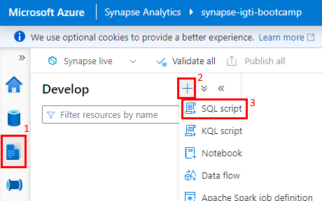

# Azure - Spark on Kubernetes

## Objetivos
* Criar infraestrutura como código
* Utuilizando um cluster Kubernetes na Azure
    * Ingestão dos dados do Enade 2017 com python para o datalake na Azure
    * Transformar os dados da camada bronze para camada silver usando delta format
    * Enrriquecer os dados da camada silver para camada gold usando delta format
* Utilizar Azure Synapse Serveless SQL Poll para servir os dados

## Arquitetura


# Passos

## Criar infra
```
source infra/00-variables

bash infra/01-create-rg.sh

bash infra/02-create-cluster-k8s.sh

bash infra/03-create-lake.sh

bash infra/04-create-synapse.sh

bash infra/05-access-assignments.sh
```

## Preparar k8s

### Baixar kubeconfig file
```
bash infra/02-get-kubeconfig.sh
```

### Para facilitar os comandos usar um alias
```
alias k=kubectl
```

### Criar namespace
```
k create namespace processing
k create namespace ingestion
```

### Criar Service Account e Role Bing
```
k apply -f k8s/crb-spark.yaml
```

### Criar secrets
```
# O arquivo .env é criado pelo script infra/05-access-assignments.sh durante a criação da infra
k create secret generic azure-service-account --from-env-file=.env --namespace processing
k create secret generic azure-service-account --from-env-file=.env --namespace ingestion
```

## Intalar Spark Operator
```
helm repo add spark-operator https://googlecloudplatform.github.io/spark-on-k8s-operator

helm repo update

helm install spark spark-operator/spark-operator --set image.tag=v1beta2-1.2.3-3.1.1 --namespace processing
```

## Ingestion app

### Ingestion Image
```
docker build ingestion -f ingestion/Dockerfile -t otaciliopsf/cde-bootcamp:desafio-mod4-ingestion --network=host

docker push otaciliopsf/cde-bootcamp:desafio-mod4-ingestion
```

### ConfigMap
```
k create configmap lake-config \
    --from-literal=storage_account_name=$STG_ACC_NAME \
    --from-literal=file_system_name=$LAKE_NAME \
    --namespace ingestion
```

### Apply ingestion job
```
k replace --force -f k8s/ingestion-job.yaml
```

### Logs
```
ING_POD_NAME=$(k get pods --selector=job-name=ingestion-job --output=jsonpath='{.items[*].metadata.name}' -n ingestion)

k logs $ING_POD_NAME -n ingestion --follow
```

## Spark

### Criar Job Image
```
docker build spark -f spark/Dockerfile -t otaciliopsf/cde-bootcamp:desafio-mod4

docker push otaciliopsf/cde-bootcamp:desafio-mod4
```

### ConfigMap
```
# Spark Operator possui algumas steps a mais para aceitar configmap, por esse motivos vamos passar como um secret
k create secret generic lake-config \
    --from-literal=storage_account_name=$STG_ACC_NAME \
    --from-literal=file_system_name=$LAKE_NAME \
    --namespace processing
```

### Apply job
```
k replace --force -f k8s/spark-job.yaml
```

### logs
```
k logs spark-job-igti-desafio-driver -n processing --follow
```

## Azure Synapse Serveless SQL Poll
Acessar o Synapse workspace através do link gerado
```
bash infra/04-get-workspace-url.sh
```
Para começar a usar siga os passos



Rodar o conteudo do script create-synapse-view.sql no Synapse workspace para criar a view da tabela no lake

Pronto, o Synapse esta pronto para receber as querys.

# Limpando os recursos
```
bash infra/99-delete-service-principal.sh

bash infra/99-delete-rg.sh
```

# Conclusão
Seguindo os passos citados é possivel realizar querys direto na camada gold do delta lake utilizando o Synapse
